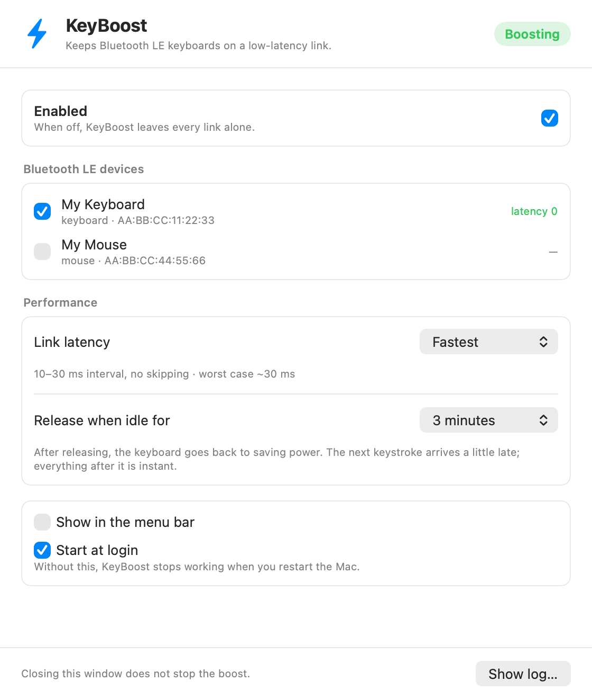

<p align="center">
  
</p>

<h1 align="center">KeyBoost</h1>

<p align="center">
  <b>Fixes the Bluetooth LE keyboard lag introduced in macOS 27.</b><br>
  Brings the link from a 345 ms worst case down to ~30 ms.
</p>

<p align="center">
  
  
  
</p>

---

## The problem

If your Bluetooth keyboard became painfully laggy after updating to macOS 27, this is probably why.

macOS 27 rebuilt LE keyboard power management around **LE Connection Subrating**, a Bluetooth 5.3
feature. It assigns the keyboard a profile carrying `peripheralLatency: 22` — meaning the keyboard
is allowed to stay silent for up to **345 ms** — and then immediately tries to neutralise that with
subrating, which would keep the keyboard listening right after any activity.

That plan is sound. It just falls apart on hardware older than Bluetooth 5.3:

```
setConnectionLatency LEHID-15ms to device "…"
update: minInterval:15.000 maxInterval:15.000 peripheralLatency:22 …

Proceeding with sending connection subrating parameters:
  subrateMin:1 subrateMax:6 maxLatency:1 continuationNumber=1
Remote Features: FF 79 2D 04 9E 03 00 00 … SupportsSubrating: 0
Remote device does not support connection subrating. (status=65535)
Failed to enter Connection Subrating Mode … Status=1330
```

The subrating request fails — **and nothing rolls back the 345 ms.** Your keyboard is left stranded.

Your keyboard even asks macOS for better parameters (7.5–12.5 ms) and gets turned down:

```
Rejecting following parameters: min=6, max=10, lat=5, mul=50, cel=4, preferredLowLatencyInterval=0
```

There is no setting anywhere in macOS that fixes this.

## The fix

A CoreBluetooth client that holds the connection and asks for low latency forces
`peripheral latency: 0`. KeyBoost is that client. It runs quietly in the background and gets out of
the way when you are not typing.

<p align="center">
  
</p>

<p align="center">
  <sub>English and Spanish, following your system language —
  <a href="docs/screenshot-es.png">Spanish</a>.</sub>
</p>

## Install

**Download the latest release**, open the `.dmg`, and drag `KeyBoost.app` to Applications.
The background engine ships inside the app — there is nothing else to install. A `.zip` is
available too if you prefer.

Because the app is not notarised, macOS will refuse the first launch. Right-click the app and pick
**Open**, then confirm. You only do this once. If macOS still blocks it:

```sh
xattr -dr com.apple.quarantine /Applications/KeyBoost.app
```

Then open KeyBoost, tick your keyboard, and turn on **Arrancar al iniciar sesión**
(start at login). That is it.

**Or build it yourself** — recommended, see [Building](#building). A locally built copy is signed
with your own certificate, which means macOS stops re-asking for Bluetooth permission.

## Permissions

**Bluetooth, once, for the engine only.** That is the entire list.

KeyBoost does **not** request Accessibility or Input Monitoring. Idle detection uses
`CGEventSourceSecondsSinceLastEventType`, a system-wide idle counter — not an event tap. It cannot
see what you type, and there is no network code anywhere in the project.

## Latency levels

Measured on macOS 27.2, not estimated — these are the parameters `bluetoothd` actually negotiates:

| Setting | Interval | Peripheral latency | Worst case |
|---|---|---|---|
| **Máxima respuesta** (default) | 10–30 ms | 0 | **~30 ms** |
| Equilibrada | 100–120 ms | 1 | ~240 ms |
| Mínimo consumo | 290–320 ms | 1 | ~640 ms |

> Note that **Mínimo consumo is worse than the bug itself** (345 ms). It exists only if you care
> far more about battery than about typing. The app warns you when you pick it.

## Battery

Holding the link at latency 0 means the keyboard listens every 30 ms, which costs battery. So
KeyBoost releases the link after a period with no typing (3 minutes by default) and grabs it back on
your next keystroke.

The trade: the **first keystroke after an idle period arrives late**, then everything is instant.
Set *Soltar tras inactividad* to **Nunca soltar** if you would rather never see that.

## How it works

Two bundles. `KeyBoost.app` is the interface — open it, change things, close it, and it disappears
from the Dock. `KeyBoostAgent.app`, nested inside it as a login item, is the engine that keeps
running. The optional menu bar icon belongs to the engine, so you can hide it without losing
anything.

Devices are remembered by **hardware address, not CoreBluetooth UUID**, so re-pairing your keyboard
or switching Bluetooth slots does not break your configuration.

Full write-up, including the three private selectors involved and why the public discovery API
returns nothing: **[docs/DESIGN.md](docs/DESIGN.md)**.

## Building

Requires Xcode Command Line Tools.

```sh
git clone https://github.com/leonardofundora/KeyBoost.git
cd KeyBoost
./build.sh
```

`build.sh` picks up any code signing identity from `security find-identity -v -p codesigning` and
falls back to ad-hoc. Signing with a real identity is what stops macOS re-asking for Bluetooth
permission after every rebuild.

## Uninstall

```sh
launchctl bootout gui/$(id -u)/com.keyboost.agent
rm -f ~/Library/LaunchAgents/com.keyboost.agent.plist
rm -rf /Applications/KeyBoost.app ~/Library/Application\ Support/KeyBoost
```

## Caveats

- **Uses private CoreBluetooth API.** There is no public way to do this. Every call is guarded with
  `responds(to:)`, so a future macOS that removes them makes KeyBoost stop helping rather than
  crash — but it will stop helping.
- **Built for macOS 27.** The bug it works around does not exist on earlier versions.
- **Not notarised.** See [Install](#install).

## Contributing

Translations are the easiest way to help: copy `Resources/en.lproj/Localizable.strings` to a new
`<language>.lproj`, translate the right-hand side, and add the language code to
`CFBundleLocalizations` in `build.sh`. The app currently ships English and Spanish.

## License

MIT — see [LICENSE](LICENSE).
